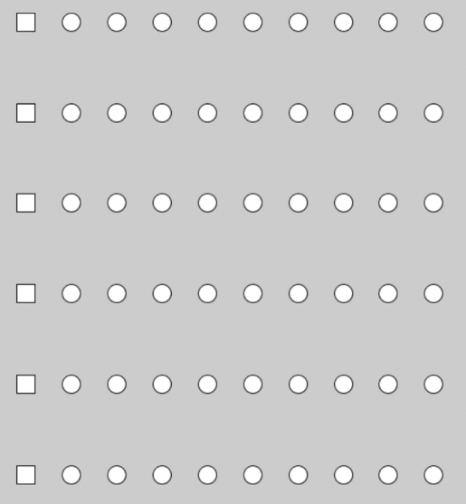
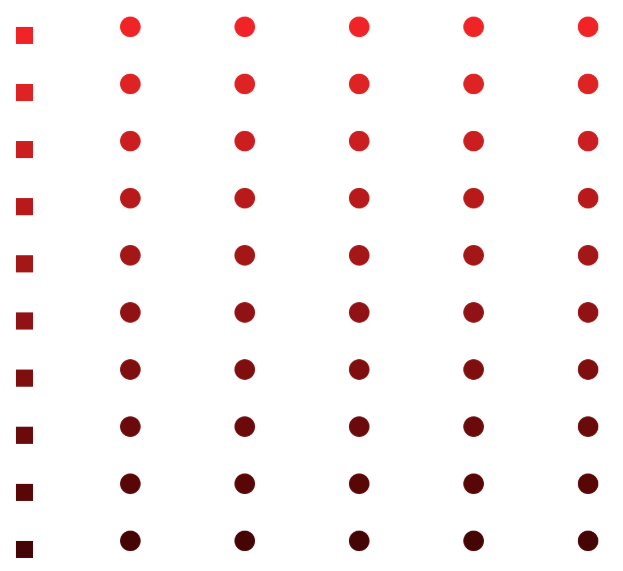

# Assignment: Lined cube

*PLEASE READ THIS **ENTIRE** DOCUMENT FIRST*

* [the assignment](#the-assignment)
* [submitting-your-work](#submitting-your-work)

## The assignment

Open a new file in your IDE

* Make an array of 10 integers (50,100,150,200,250,300,350,400,450,500)
* Make an array of 6 integers (100,200,300,400,500,600)
* Using only vanilla javascript, use 2 loops to recreate the image below.

* Variate the r value of the fill (rgb) to get a result that looks like the image below.

## Submitting your work
Create a new branch called **gh-pages** and upload your local work into this branch. Submit a new **pull request** and make sure to put the (working) **GitHub Pages URL** in the comment section. 
